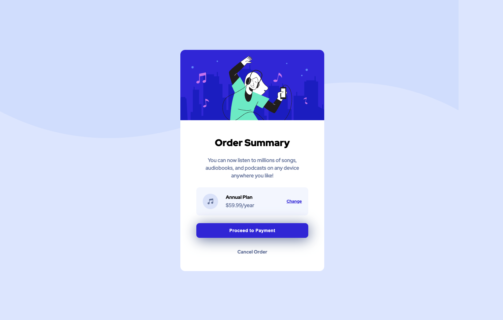

# Frontend Mentor - Order summary card solution

This is a solution to the [Order summary card challenge on Frontend Mentor](https://www.frontendmentor.io/challenges/order-summary-component-QlPmajDUj). Frontend Mentor challenges help you improve your coding skills by building realistic projects.

## Table of contents

-   [Overview](#overview)
    -   [Screenshot](#screenshot)
    -   [Links](#links)
-   [My process](#my-process)
    -   [Built with](#built-with)
    -   [What I learned](#what-i-learned)
-   [Author](#author)

## Overview

### Screenshot

### Links

-   [Solution LINK](https://www.frontendmentor.io/solutions/order-summary-component-7PeXSg1kyf)
-   [Live Site LINK](https://alvaro-frontend-mentor-projects.github.io/order-summary-component/)

## My process

### Built with

-   Semantic HTML5 markup
-   CSS custom properties
-   Flexbox

### What I learned

Used this project to keep learning raw css

## Author

-   Website - [Portfolio](https://alvaroormeno.github.io/alvaro-portfolio-v1/)
-   Frontend Mentor - [@alvaroormeno](https://www.frontendmentor.io/profile/alvaroormeno)
-   Instagram - [@alvaroormeno](https://www.instagram.com/alvaroormeno/)
